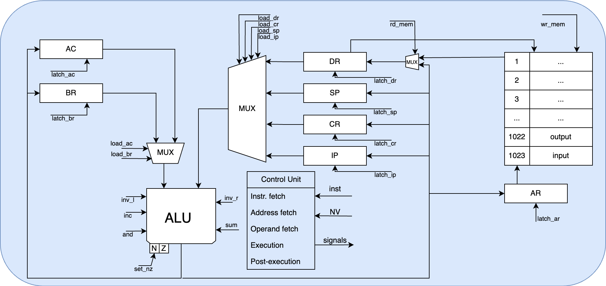
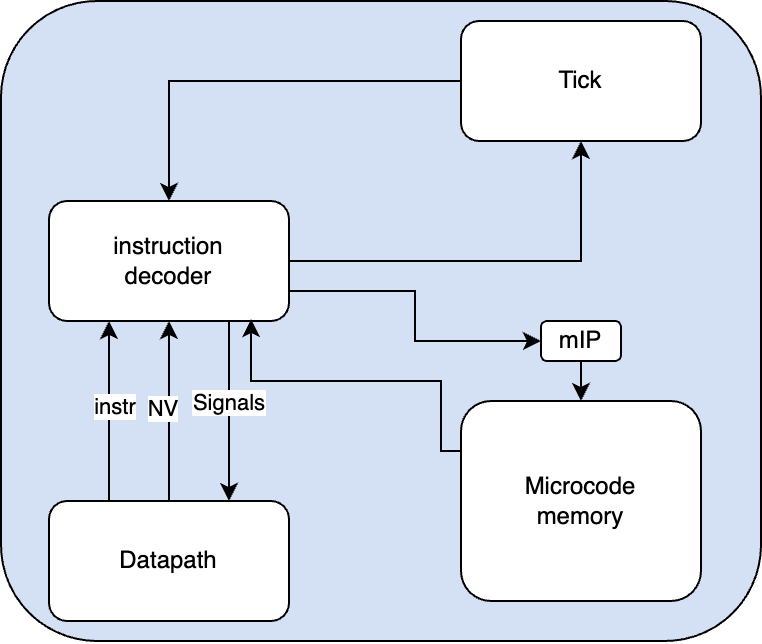
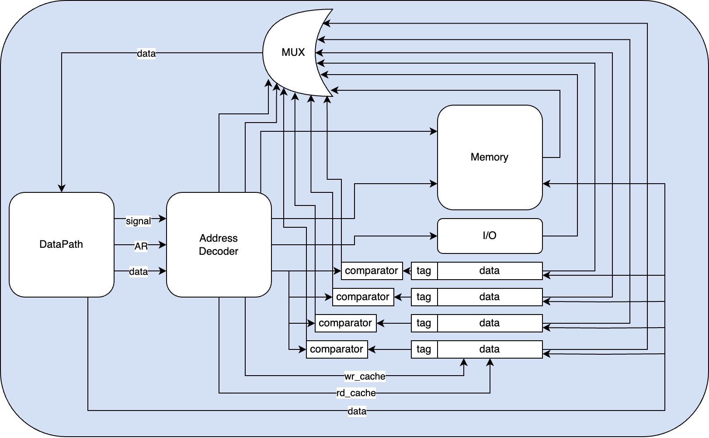

# Лабораторная работа №3
## Вариант:
asm | acc | neum | mc -> hw | tick -> instr | struct | stream | mem | pstr | prob1 | cache
Вариант с усложнением\
Язык: Python
## Язык программирования ASM
### Синтаксис
```ebnf
<program> ::= single_line |  single_line "\n" program

<single_line> ::= label + command_line | comand_line

<label> ::= label_name + ":(\s | \n)"

<label_name> ::= <any of "a-z A-Z _"> | start_section

<start_section> ::= "START:" + ("\s" | "\n")

<command_line> ::= op_code address?  comment?


<op_code> ::= nope
   | add
   | sub
   | ld
   | wr
   | push
   | pop
   | swap
   | call
   | ret
   | cmp
   | jmp
   | je
   | jne
   | jg
   | jl
   | hlt
   | word
   | org
   
<address> ::= integer
            | label
            | "#" + integer
            | "#" + label
            | ("+" | "-") integer
            | ("+" | "-") label
            | "[" + integer + "]"
            | "[" + label + "]"
            | "[" + ("+" | "-") integer + "]"
            | "[" + ("+" | "-") label + "]"
            | character
            
<comment> ::= ";" + <any of "a-zA-Z0-9">
            
<integer> ::= <any of "0-9">

<character> ::= "'" + "a-zA-Z0-9" + "'"

```
### Семантика
Операции:\
+ `add` – суммировать значение по адресу с AC
+ `sub` – вычесть значение по адресу из AC
+ `ld` – загрузить значение по адресу в AC
+ `wr` – записать значение из AC по адресу
+ `push` – положить значение из AC на стек
+ `pop` – снять значение со стека в AC
+ `swap` – обменять значение на стеке и в AC
+ `call` – выполнить вызов функции
+ `ret` – выполнить возврат из функции
+ `cmp` – пробно вычесть значение из AC по адресу, расставив флаги 
+ `jmp` – выполнить безусловный переход по адресу
+ `je` – выполнить переход, если Z == 1
+ `jne` – выполнить переход, если Z == 0
+ `jg` – выполнить переход, если N == 0 и Z == 0
+ `jl` – выполнить переход, если N == 1 и Z == 0
+ `hlt` – останов
+ `word` – вынести данные в ячейку
+ `org` – переход на указанный адрес

### Адресации
+ `123` – прямая-абсолютная. Указывает на значение по адресу ячейки
+ `(+|-)123` – прямая-относительная. Указывает на значение ячейки с адресом AR + смещение
+ `[123]` – косвенная-прямая. Указывает на значение по адресу, лежащем в адресованной ячейке
+ `[(+|-)123]` – стековая относительная. Указывает на значение ячейки по адресу SP + смещение
+ `#123` – прямая загрузка операнда в команду

### Литералы
+ Поддерживается два типа: `число` и `символ`
+ `Число` – преобразуется и загружается напрямую
+ `Символ` – преобразуется в код символа и работает также, как числовой

## Организация памяти
+ Фон-Неймановская архитектура – общая память для инструкций и данных
+ Размер машинного слова не определен (данные в памяти представляют из себя структуры данных)
+ Инструкция и данные взаимо-конвертируемы

Память адресуется двумя регистрами:
+ `AR` – регистр адреса для обращения к памяти
+ `SP` – регистр, указывающий на верхушку стека

### Модель памяти
```text
   Registers
+------------------------------+
| AC     IP     SP      DR    |
| BR     AR     IP            |
+------------------------------+

  Instruction and data memory
+------------------------------+
| 00   : value                  |
| 01   : value                  |
| 02   : value                  |
|     ...                       |
| n    : program start          |
|      : hlt                    |
|     ...                       |
| i    : function 0             |
|     ...                       |
| 1022 : output                 |
| 1023 : input                  |
+------------------------------+
```
## ISA
| Мнемоника | Синтаксис | Количество тактов | Описание                                                                      |
|-----------|-----------|-------------------|-------------------------------------------------------------------------------|
| add       | add 123   | 2                 | Cуммировать значение по адресу с AC                                           |
| sub       | sub 123   | 2                 | Вычесть значение по адресу из AC                                              |
| ld        | ld 123    | 2                 | Загрузить значение по адресу в AC                                             |
| wr        | wr 123    | 2                 | Записать значение из AC по адресу                                             |
| push      | push      | 3                 | Положить значение из AC на стек                                               |
| pop       | pop       | 5                 | Снять значение со стека в AC                                                  |
| swap      | swap      | 6                 | Обменять значение на стеке и в AC                                             |
| call      | call #123 | 5                 | Выполнить вызов функции (использовать прямую загрузку адреса)                 |
| ret       | ret       | 5                 | Выполнить возврат из функции                                                  |
| cmp       | cmp       | 2                 | Пробно вычесть значение из AC по адресу, расставив флаги                      |
| jmp       | jmp #123  | 2                 | Выполнить безусловный переход по адресу (использовать прямую загрузку адреса) |
| je        | je #123   | 3                 | Выполнить переход, если Z == 1 (использовать прямую загрузку адреса)          |
| jne       | jne #123  | 3                 | Выполнить переход, если Z == 0 (использовать прямую загрузку адреса)          |
| jg        | jg #123   | 3                 | Выполнить переход, если N == 0 и Z == 0 (использовать прямую загрузку адреса) |
| jl        | jl #123   | 3                 | Выполнить переход, если N == 1 и Z == 0 (использовать прямую загрузку адреса) |
| hlt       | hlt       | 1                 | Завершить работу машины                                                       |
| word      | word 123  | транслятор        | Внести данные в ячейку                                                        |
| org       | org 123   | транслятор        | Перейти по адресу                                                             |

## Формат инструкций
Инструкции хранятся в формате JSON:
```json
{
  "name": "ld",
  "op_code": "LD", 
  "addressing_type": "DIRECT_LOAD", 
  "is_start": false, 
  "address": 3
}
```
Поля инструкции:
+ `name` – мнемоника инструкции
+ `op_code` – код операции
+ `addressing_type` – тип адресации
+ `is_start` – является ли стартовой (после метки START)
+ `address` – аргумент команды

## Транслятор
### Интерфейс командной строки:
`Translator.py <input_file> <output_file>`\
[Translator.py](impl/Translator.py)

### Этапы трансляции
+ Считывание данных из файла
+ Удаление `комментариев`
+ Поиск и замена `меток` и `символьных литералов`
+ Сбор `лексем` с помощью `регулярных выражений` и работы конечного автомата
+ `Анализ лексем` на наличие синтаксических ошибок
+ `Конвертация` лексем в команды и формирования стека памяти
+ `Сохранение` полученного файла

Сбор лексем осуществляется за счет разбиения исходного файла на слова и парсинга их регулярными выражениями.
Анализ происходит с помощью конечного автомата.
Полученная лексема отмечается и сохраняется в список лексем.\
В случае перехода автомата в состояние ошибки, трансляция прекращается, а пользователю выводится проблемная лексема и возможное исправление.\
После работы конечного автомата, полученные лексемы преобразуются в команды.\
#### Автоматная грамматика
```text
S    -> (^[a-zA-Z]+$)MNC | E
MNC  -> ( ^(\[|\+|-|#){0,1}\d+(\]){0,1}$ )ADDR | (^[a-zA-Z]+$)MNC
ADDR -> (^[a-zA-Z]+$)MNC | E
E    -> to stderr
```
## Процессор
### Интерфейс командной строки
`Machine.py <code_file> <input_stream_file> <logs_file>`\
[Machine.py](impl/Machine.py)

### Datapath

#### Сигналы
+ `latch_AC` – защелкнуть AC
+ `latch_BR` – защелкнуть BR
+ `latch_DR` – защелкнуть DR
+ `latch_CR` – защелкнуть CR
+ `latch_SP` – защелкнуть SP
+ `latch_IP` – защелкнуть IP
+ `latch_AR` – защелкнуть AR
+ `rd_mem` – считать из памяти по AR
+ `wr_mem` – записать в память по AR
+ `load_AC` – загрузить AC на левый вход ALU
+ `load_BR` – загрузить BR на левый вход ALU
+ `load_DR` – загрузить DR на правый вход ALU
+ `load_CR` – загрузить CR на правый вход ALU
+ `load_SP` – загрузить SP на правый вход ALU
+ `load_IP` – загрузить IP на правый вход ALU
+ `CR_addr_to_bus` – загрузить адрес команды на правый вход ALU
+ `invert_left` – инвертировать левый вход ALU
+ `invert_right` – инвертировать правый вход ALU
+ `sum` – сложить два входа ALU
+ `and` – побитовое И
+ `inc` – инкрементировать выход ALU
+ `set_NZ` – установить значения флагов
### Control unit



#### Сигналы для управляющих микроинструкций
+ `CHCK_ADDR_TYPE` – проверка типа адресации
+ `JUMP` – безусловный переход в микрокоде
+ `JUMP_TO_CR_OPCODE` – Переход на выполнение инструкции
+ `JUMP_IF` – условный переход по микрокоду
+ `CHECK_Z` – условие перехода Z==1
+ `CHECK_N` – условие перехода N==1
+ `CHECK_nZ` – условие перехода Z==0
+ `CHECK_nN` – условие перехода N==0
+ `HLT` – остановка работы тактового генератора

Метод `start` эмулирует работу полного цикла машины.
#### Цикл обработки инструкции
+ Выборка инструкции
+ Выборка адреса
+ Выборка операнда
+ Выполнение инструкции
+ Пост-выполнение инструкции для инкремента IP

#### Принцип работы
+ Создание лога процессора
+ Микроинструкция загружается по адесу из mIP
+ Проверяется тип микроинструкции(управляющая или обычная)
+ Обработка сигналов, содержащихся в микроинструкции в следующем порядке:
    + Сигналы чтения из регистров
    + Сигнал чтения из памяти
    + Сигналы работы с ALU и флагами
    + Сигналы защелкивания регистров
    + Сигнал записи в память
+ Инкремент счетчика микрокоманд (mIP)
+ Возврат значения: нужно ли продолжать симуляцию

## Кэш
+ Полностью ассоциативный
+ 4 кэш-линии
+ Политика вытеснения: случайная
+ Политика записи: write-through

+ 
Показатели работы кэша на алгоритме `prob1`, сумма делителей от 1 до 999(доступ к памяти – 10 тактов, к кэшу – 1):

| Кол-во линий | Кол-во тактов |
|------------|---------------|
| 0          | 186198        |
| 3          | 185094        |
| 4          | 182333        |
| 5          | 180142        |
| 6          | 177351        |
| 7          | 174060        |
| 8          | 171079        |
| 9          | 168058        |
| 10         | 165087        |

Из-за случайной политики вынесения из кэша, 
количества тактов между увеличениями числа кэш-линий меняется не так существенно.

Основной цикл программы состоит из 32 инструкций.
